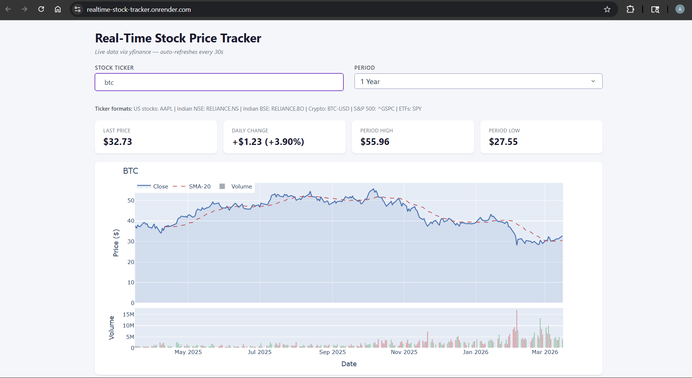

# Real-Time Stock Price Tracker

Live-updating Dash app that tracks stock prices for any publicly listed company with SMA overlays and volume charts. Uses yfinance for real market data with automatic synthetic fallback.


---

## Live Demo

**[https://realtime-stock-tracker.onrender.com](https://realtime-stock-tracker.onrender.com)**

> Hosted on Render free tier — may take 30 to 60 seconds to wake up on first load.

---

## Preview



---

## Table of Contents

- [Overview](#overview)
- [Why I Made This](#why-i-made-this)
- [Features](#features)
- [Project Structure](#project-structure)
- [Requirements](#requirements)
- [Quick Start](#quick-start)
- [How It Works](#how-it-works)
- [Changes Made and Why](#changes-made-and-why)
- [Deployment](#deployment)
- [What I Learned](#what-i-learned)

---

## Overview

This project is a live-updating stock price dashboard built with Plotly Dash and yfinance. Unlike most stock dashboard tutorials that use a fixed dropdown of a few companies, this app accepts any ticker symbol supported by Yahoo Finance — US stocks, Indian stocks, crypto, indices, and ETFs — and fetches real historical data on demand. A synthetic fallback using geometric Brownian motion ensures the app always works even when yfinance is unavailable.

---

## Why I Made This

I wanted to build a project that worked with real, live external data rather than a static CSV or a generated dataset. Most data science projects stop at model training — I wanted to go further and build something that updates automatically without any user action. The 30-second interval refresh and the free-text ticker input were both deliberate choices: the interval keeps the data current during a trading session, and the open ticker input means the app is genuinely useful rather than just a demonstration with five hardcoded companies. I also wanted to practice handling real-world API unreliability — yfinance can hang or fail — which is something that never comes up in tutorial datasets.

---

## Features

**Input**
- Free-text ticker input — accepts any symbol Yahoo Finance supports
- Type any ticker and press Enter — no predefined list
- Ticker format reference shown below the input field

**Ticker formats supported**

| Market | Format | Example |
|---|---|---|
| US stocks | Ticker only | AAPL, DELL, NVDA |
| Indian NSE | Ticker + .NS | RELIANCE.NS |
| Indian BSE | Ticker + .BO | RELIANCE.BO |
| Crypto | Ticker + -USD | BTC-USD, ETH-USD |
| S&P 500 index | ^GSPC | ^GSPC |
| ETFs | Ticker only | SPY, QQQ |

**Period selector**
- 1 Month, 3 Months, 6 Months, 1 Year

**KPI Cards (4, fully reactive)**
- Last Price
- Daily Change ($ and %)
- Period High
- Period Low

**Chart**
- Price area chart with adaptive SMA overlay (SMA-10 for 1 Month, SMA-20 for longer periods)
- Volume subplot with green/red/grey color-coded bars
- Shared x-axis, unified hover, stacked subplots

**Live behavior**
- Auto-refreshes every 30 seconds via dcc.Interval
- 10-second timeout on yfinance calls to prevent the app from hanging
- Graceful synthetic fallback if yfinance is unavailable
- Clear error message shown for invalid ticker symbols

---

## Project Structure

```
realtime-stock-tracker/
│
├── app.py                  Dash app: data fetching, layout, and callback logic
├── assets/
│   ├── style.css           Dashboard styling (auto-loaded by Dash)
│   └── preview.png         Dashboard screenshot for README
├── requirements.txt        Python dependencies
├── render.yaml             Render deployment config
├── .gitignore
└── README.md
```

---

## Requirements

```
dash
plotly
pandas
numpy
yfinance
gunicorn
```

```bash
pip install -r requirements.txt
```

---

## Quick Start

```bash
git clone https://github.com/abhinab44/realtime-stock-tracker.git
cd realtime-stock-tracker
pip install -r requirements.txt
python app.py
```

Open `http://127.0.0.1:8050` in your browser. Type any ticker symbol and press Enter.

---

## How It Works

**Data fetching with timeout**

Every callback invocation calls `fetch_data(ticker, period)`, which runs yfinance in a background thread with a 10-second timeout. If the thread does not complete in time, it falls through to the synthetic fallback rather than hanging the entire app:

```python
t = threading.Thread(target=_fetch)
t.start()
t.join(timeout=10)
if t.is_alive() or result[0] is None:
    raise Exception('yfinance timeout')
```

**Adaptive SMA window**

The 1 Month period returns only 22 trading days. SMA-20 on 22 points produces only 3 valid values, making the overlay nearly invisible. The window adapts automatically:

```python
sma_window = 10 if len(close) < 60 else 20
```

**Volume color logic**

Volume bars are color-coded: green if the close was higher than the previous day, red if lower. The first bar has no previous reference, so it is colored neutral grey rather than defaulting green:

```python
colors = ['#6c757d']
colors += ['#55A868' if close.iloc[i] >= close.iloc[i - 1]
           else '#C44E52' for i in range(1, len(close))]
```

**Synthetic data stability**

Without a fixed seed, the synthetic fallback generated completely different data on every 30-second refresh, causing KPIs to jump randomly. The seed is now derived from the ticker and today's date so synthetic data stays stable within a day:

```python
np.random.seed(hash(ticker + str(pd.Timestamp.today().date())) % (2**32))
```

---

## Changes Made and Why

**1. Free-text input replacing fixed dropdown**

The original app had a hardcoded dropdown of 5 stocks. This was replaced with a `dcc.Input` field so any ticker on Yahoo Finance can be queried — US stocks, Indian stocks, crypto, indices, and ETFs all work without any code changes.

**2. OHLC integrity fix**

In the synthetic fallback, Open was generated independently of High and Low using a separate random draw. This produced physically impossible candles where Open was above High or below Low. High and Low are now generated first, and Open is interpolated between them to guarantee valid OHLC relationships.

**3. SMA adaptive window**

SMA-20 on the 1 Month period (22 days) produced only 3 visible data points on the overlay. The window now switches to SMA-10 for periods under 60 days so the overlay is always meaningful.

**4. Synthetic data seed stabilization**

No seed was set in the original fallback, so every 30-second refresh produced entirely new random prices. KPIs would jump to different numbers on every interval tick. The seed is now tied to the ticker and current date so values stay consistent throughout the day.

**5. Volume bar first-element fix**

The original color logic used `close[max(0, i-1)]` for index 0, which compared a value to itself and always produced green. The first bar now uses neutral grey since there is no prior close to compare against.

**6. yfinance timeout**

Without a timeout, a slow or unresponsive Yahoo Finance call would block the entire Dash server thread indefinitely, causing the app to appear frozen. yfinance now runs in a background thread with a 10-second limit before falling back to synthetic data.

---

## Deployment

Deployed on [Render](https://render.com) using `render.yaml` and gunicorn.

`app.py` exposes the Flask server instance required by gunicorn:

```python
app = dash.Dash(__name__)
server = app.server
```

`render.yaml`:

```yaml
services:
  - type: web
    name: realtime-stock-tracker
    runtime: python
    buildCommand: pip install -r requirements.txt
    startCommand: gunicorn app:server
    plan: free
```

To deploy your own instance: fork this repo, go to Render, create a new Web Service, connect the repo, and Render auto-detects `render.yaml` and deploys automatically.

---

## What I Learned

- How `dcc.Interval` drives live updates in Dash and where its limitations are — it refreshes on a timer regardless of whether markets are open, which means unnecessary API calls on weekends
- How to run blocking I/O in a background thread with `threading.Thread` and `join(timeout=...)` to prevent a slow external API from freezing a single-threaded web server
- Why OHLC candle data has strict relationships between Open, High, Low, and Close — and how independently generated random values can violate those constraints in ways that are invisible until you check programmatically
- How geometric Brownian motion models price evolution and why a fixed seed is necessary for stable synthetic data across repeated renders
- How yfinance handles different ticker formats for international markets and why the same company can have different symbols on different exchanges
- How Dash's `assets/` folder automatically injects CSS without any manual import
- How to expose a Dash app as a WSGI application for production deployment with gunicorn on Render

---

## License

This project is open-source under the [MIT License](LICENSE).

---

*Built with Python 3.8+ · Plotly Dash · yfinance · pandas · NumPy · Deployed on Render*
